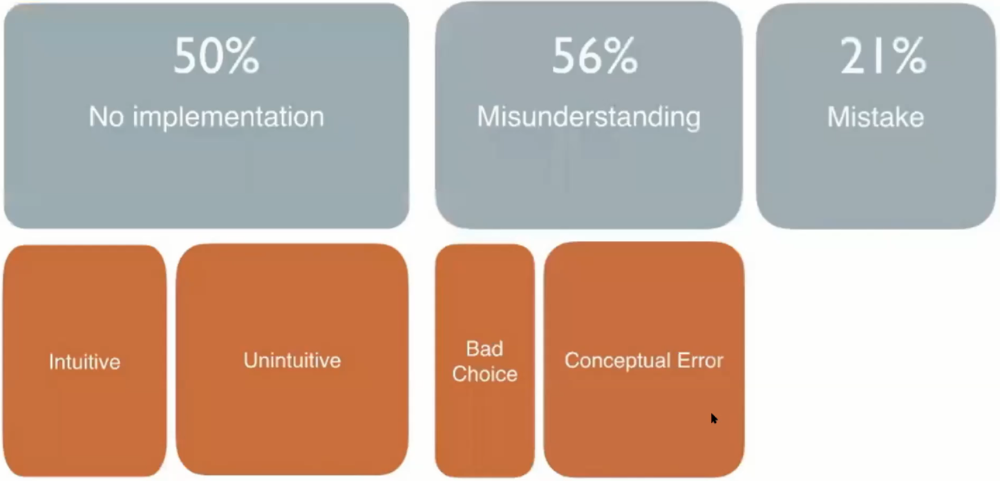
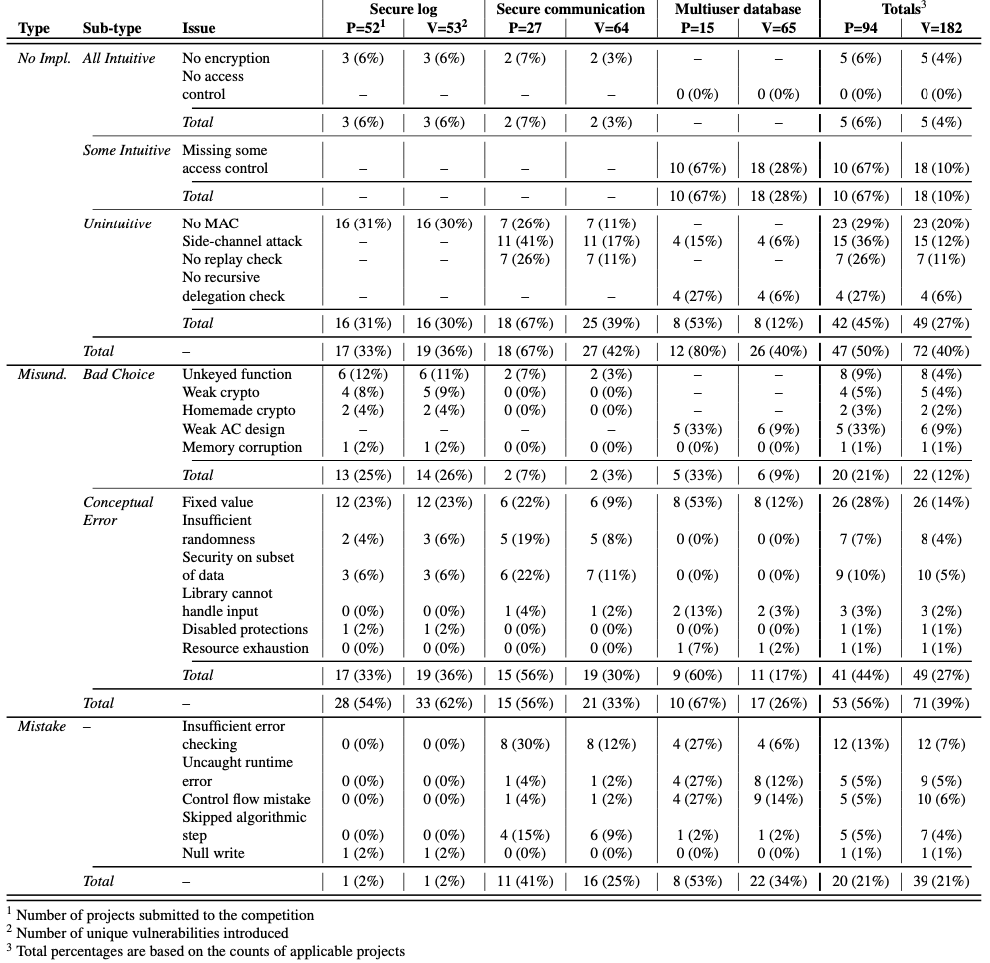
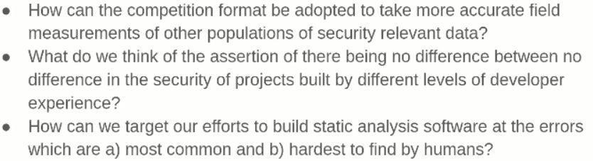

## Abstract
This paper aims to study and categorize the various types of mistakes developers make regarding security.
In order to do this, they leveraged a Build It, Break It, Fix It competition to obtain data on the introduction of errors as well as their exploitation and subsequent fixes.
Vulnerabilities were categorized according to how they were introduced, level of control they allowed, and how easily they could be exploited.
Once the raw data was categorized, certain trends emerged: outright mistakes where the developer didn't implement what they meant to were relatively uncommon, while the most common type of vulnerability was that introduced through misconceptions of security concepts (API misuse, etc.).

# Background & data

This paper presents a systematic, in-depth examination of vulnerabilities present in software projects. based on a secure programming competition: Build It, Break It, Fix It.

As it's name, it comprises three phases:

- Build it

  Participating teams are given two weeks to build a project, for either a secure event-logging system, a secure communication system simulating an ATM and a bank, or a scriptable key-value store with role-based access control policies. They must meet a core set of functionality requirements, but teams may optionally implement additional features for more points.

- Break it

  In this phase, teams are given access to the source code of their fellow competitors’ projects to look for vulnerabilities and create a test case to prove the vulnerabilities (POC). Breaks are validated in different ways: comparing the output against a "known correct" reference implementation; or confirming leak of sensitive data.

- Fix it

  The final phase for teams is to fix those bugs, in order to identify essential same breaks to prevent double counted scores.

## Data

As mentioned, the projects covering three programming problems:

- Secure log

  It includes securely appending records to a log and securely querying the log. The build it score is measured by log query/append latency and space utilization.

- Secure communication

  A pair of client/server programs, represent a bank and an ATM which
  initiates account transactions. Build-it performance is measured by transaction latency. There are no optional features.

- Multiuser database

  It ask teams to create a server that maintains a secure key-value store. Build-it performance is assessed by the domain-specific language running time. Optional features take the form of additional script commands.

# Research question

1. What types of vulnerabilities do developers introduce? Are they conceptual flaws in their understanding of security requirements or coding mistakes?
2. How much control does an attacker gain by exploiting the vulnerabilities, what is the effect?
3. How exploitable are the vulnerabilities? What level of insights is required and how much work is necessary? 

# Methodology question

- Is that sample of projects representative of real world?

  - Yes: 
    - The competition's scoring format matches real world incentives
    - The project task are big and complicated
    - The participants are experienced developers and students who were taking corresponding security class
  - No:
    - Time pressure is hard to simulate
    - Only three type of project tasks
    - Teams know it's a security competition, so they may prioritize security

- How can we categorize programming errors?
- How can we quantify errors' exploitability?

# Error Categorization
They broke observed errors down into several types: no implementation, misunderstandings, and outright mistakes.

## No Implementation
No implementation errors were the simple case where a team did not even attempt to provide a required security feature, such as an implementation of secure log with no integrity checking.
Within the umbrella of no implementation, they sub-divided further to consider *all intuitive*, *some intuitive*, and *unintuitive* separately.
The first two categories comprise those missing features that were at least partially either mentioned in the specification or considered obvious from the requirements.
The last category, unintuitive, comprised errors where the required security feature was not explicitly stated or intuitive, such as the need to use MACs to ensure integrity.
Examples of *all intuitive* errors were not using encryption in the secure log and secure communication tasks, as well as not attempting to enforce the access control aspect of the multiuser-database task.
Some teams only partially implemented these access control requirements which was coded as *some intuitive*.
The *unintuitive* errors were more varied. Teams failed to use MACs to ensure integrity in the secure log and secure communication tasks.
There were side channels leaking data in the secure communication and multiuser-database tasks.
Replay attacks could be used against some secure communication implementations.
Finally, user rights were not properly checked in the case of delegation in the multiuser-database task.

## Misunderstandings
A vulnerability was categorized as a misunderstanding when a team attempted to implement security requirements, but made mistakes in doing so.
These were further sub-divided into *bad choices* and *conceptual errors*.

Bad choices represent inherently insecure choices, of which five distinct instances were observed.
Of note among these was the use of bespoke encryption; one team chunked cleartext by the key length and XORed these chunks with the key, trivially allowing the key to be recovered from two blocks of the ciphertext.
Another common issue was using functions that could compromise memory safety, such as using `strcpy`.
The authors chose to class this is a bad choice rather than an outright mistake due to the existence of `strlcpy`.

Conceptual errors represent the misuse of not-inherently-insecure mechanisms.
For example, cryptographic algorithms often require random values as initialization and may harm security if not actually random.
Hard-coding passwords was also classified as a conceptual error.
Other issues categorized as conceptual errors included correct usage of security features while failing to protect everything needed to provide security.
For instance, one team ensured integrity of individual log entries but not the log as a whole, ostensibly preventing modification of individual entries but allowing arbitrary deletion/duplication/reordering.
Another example of this issue was the disabling of built-in protections; one team disabled automatic MAC usage in their SQL library.

## Mistakes

The final category of error is outright developer mistakes.
Examples of this type of error include improper error handling leading to the application hanging or crashing.
Other examples include control flow logic errors; one team failed to properly store data they later checked the presence of, leading to their check always returning the same result.

# Quantifying Exploitability

In addition to categorizing vulnerabilities introduced in the "build it" phase, the paper also categorizes the exploitation of these vulnerabilities.
This is broken down into three different analyses: the difficulty of discovering the vulnerability, the difficulty of exploiting the vulnerability, and whether the vulnerability was actually exploited during the "break it" phase.

Difficulty in discovery was broken into two groups: "easy" discoveries, those requiring only execution, such as observing a segfault and then looking for a buffer overflow, and "hard" discoveries, those requiring either access to the source or deep insight into the design and implementation.
Likewise, difficulty in exploitation was broken into groups: "easy" exploits require only a single step or a few steps to exploit, "hard" exploits require many steps and may be probabilistic.

Their analysis rated errors introduced through misunderstandings as hard to discover, as they often rested on the attacker having a good idea of the process taken by the original developer.
However, the rates of actual exploitation in the "break it" phase did not show that misunderstandings resulted in exploitation significantly more often.

Conversely, "no implementation" errors were rated as easy to find, as they could usually be discovered by checking for the necessary mechanisms (i.e. an integrity check, or any mechanism to enforce access control).
While none of the whole or partially "intuitive" vulnerabilities (those directly implied by the specification) were rated as hard to exploit, nearly half of the "unintuitive" vulnerabilities were.
An example given in the paper is the lack of MACs in the secure log task; it is quite easy to discover that MACs are not in use, but one implementation was still not exploited despite this lack.
Their implementation encrypted data after serializing to JSON and any modifications to the non-integrity-checked encrypted data had to maintain that structure in order to successfully deserialize.

Vulnerabilities classed as mistakes were rated as both easy to find and easy to exploit, which was born out by the actual data from the "break it" phase: there was only one vulnerability resulting from a mistake that was *not* exploited by any team.
Their conclusion is that although outright mistakes were less likely to make it through the development process, those that did were highly likely to be discovered and exploited.

No significant differences between the rates of partial and full control after exploitation were found, although the authors note that vulnerabilities introduced through misunderstandings were observed to cede full control slightly more often than the other categories of error (70% vs. 61%, 51%).

# Results

## Types of errors

## Risk factors of errors prevalence

  Teams that used more popular languages had a higher prevalence of errors.  However, this may be related to experience, as less experienced participants are likely to prefer popular languages.
  There was no significant difference in errors introduced by student participants compared to professional participants.

## Risk factors of attacker control

Vulnerability impact was separated into two different categories: discovery difficulty and exploit difficulty.

- Discovery Difficulty

  _no implementation_  and _mistake_ errors were easy to find.  Conversely _Misunderstandings_ were difficult to identify.  This is attributed to additional knowledge required by an attacker to identify the error.

- Exploit Difficulty

  The _intuitive_ and _some intuitive_ _No Implementation_ errors were rated as not difficult to exploit.  The _unintuitive_ _no implementation_ errors presented a greater challenge.
  The _misunderstanding_ errors were not significantly more difficult to exploit once found.

- Attacker Control

  No significant difference was found between the error types with respect to attacker control.  The BIBIFI challenge did not reward differing point values based upon attacker control levels.
  The data does indicate that _misunderstanding_ errors result in full attacker control more often then _no implementation_ or _Mistake_ errors.

# Recommendation

Based on the results showed in the experiment, the paper suggest several possible solutions:

- compare to real-world vulnerabilities

  By compiling the list of vulnerabilities by exploring BIBIFI projects, the result shows that the list closely resembles both Mitre’s CWE and OWASP’s Top Ten lists, including: : broken authentication (e.g., insufficient randomness), broken access control, security misconfiguration (e.g., using an algorithm incorrectly or with the wrong default values), and sensitive data exposure (e.g. side-channel leak).

  So suggestion for who want to find errors in real-world programs, it's natural and promising to start from the CWE and OWASP’s Top Ten lists.

- hire a security expert

  In some large organizations, developers working with cryptography and other security-specific features might be required to use security expert determine tools and patterns to use or have a security expert perform a review. The results reaffirm this practice, when possible, as participants were most likely to struggle with security concepts avoidable through expert review.

- better secure API design

  The results support the basic idea that security controls are best applied transparently, e.g., using simple APIs. However, while many teams used APIs that provide security (e.g., encryption) transparently, they were still
  frequently misused (e.g., failing to initialize using a unique IV
  or failing to employ stream-based operation to avoid replay
  attacks). So it may be beneficial to organize solutions around
  general use cases, so that developers only need to know the
  use case and not the security requirements.

- better API docs

  A example from the experiment, teams SC-18 and SC-19 used TLS socket libraries but did not enable client-side authentication. This kind of failure appears to have occurred because client-side authentication is disabled by default, but this fact is not mentioned in the documentation.

  So defaults within an API should be safe and without ambiguity, and better documentation would be helpful also form security side.

- better security education

  The authors note that many of the teams in our data had completed a cybersecurity MOOC prior to the competition. And all needed security controls for the problems were discussed in the lecture slides. But still a majority of teams failed to include Unintuitive requirements.

  An environment like BIBIFI, where developers practice implementing security concepts and receive feedback regarding mistakes, could help. Future work should consider how well competitors from one contest do in follow-on contests.

- better analysis tools

  The result shows that lots of popular automatic tools would not have applied to the majority of vulnerabilities they saw, which are often design-level, conceptual issues. An interesting question is how automation could be used to address security requirements at design time.

# Discussion:

Presentation team Stapler presents several questions in slides to discuss:

During the presentation we also discuss about these interesting questions:

- About the result shows there are no significant difference between professional and student errors

One of the reason might be whether there are enough practical security experience for the participants, because there are many differences between security training and certain actual experience, so it's hard to measure how "professional" a developer is, especially in security aspect. For example, a professional developer would still be very likely to make the same mistakes as students, if the project/language is new to him/her, or certain API or documentation is not safe by default, eg. for performance reason.

Besides misunderstanding errors on specific cases, how can we measure the "professional" better in general? It's still an interesting problem to explore, maybe CTF background? 

Other than personal measurement, a team's size and structure could also affect. For example if the main contribution is from less people, it loses certain objective, and gets harder review code, etc.  

- About static analysis tools failing at most cases

Is it suggests possibilities of dynamic/semantic aware ways? For example, a hard coded AES IV problem is easy for static ways, what about similar problems but in dynamic ways more generally? Most papers from crypto area analysis are limited in one type of vulnerabilities.

And on most errors mentioned in the paper, tools are failing at those design/logic level issues. For this kind of errors, does it have to require general intelligence like human? As more powerful AI techniques developing, such as GPT3, how to apply them into security field is a big topic. Similar effort on this from a CCS paper this year: it does NLP on library API and its document, to try to derive relationships and identify misuses. 

- About results showing more high level, abstract bugs from popular language

Would programming languages that are more popular cause more bugs? On one hand yes, popular means higher chances to get errors, or less popular indicates more professional developers; on the other hand, as the paper mentioned, the categories of vulnerabilities don't seems like language-related, such as "Unkeyed function", "No MAC", "No encryption", etc. 

- Would this paper somehow restrict the follow up work?

Would this paper's result be abused, and be cited as "laws", to restrict the follow up direction?
