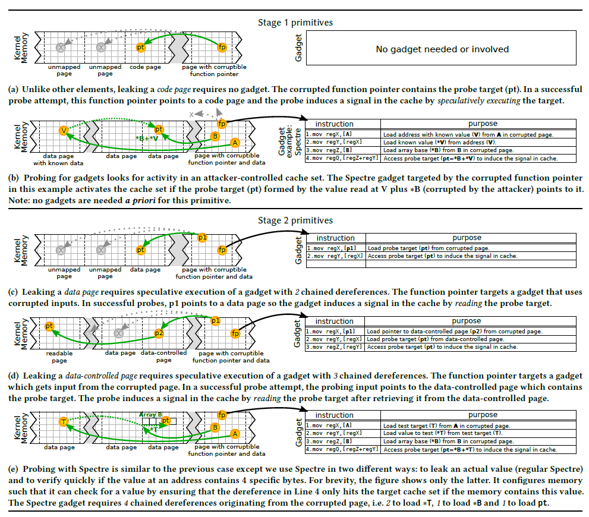
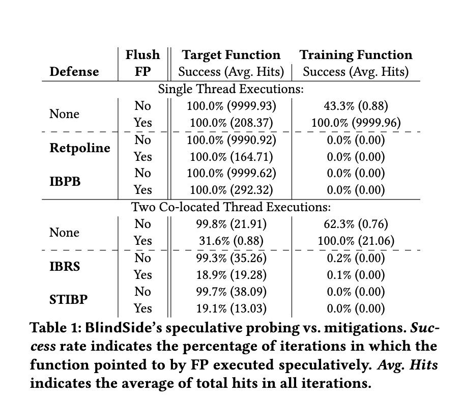

## Paper Info
- **Paper Name**: Speculative Probing - Hacking Blind in the Spectre Era
- **Conference**: CCS '20
- **Author List**: Enes Göktaş, Kaveh Razavi, Georgios Portokalidis, Herbert Bos, Cristiano Giuffrida
- **Link to Paper**: [here](https://download.vusec.net/papers/blindside_ccs20.pdf)
- **Food**: Apple Pie

## Prerequisites

There were a lot of prerequisites to this paper, and if you don’t already have a fundamental understanding of binary exploitation, this paper may be significantly hard to read. To be best prepared for this paper we recommend some of the topics below:

- **Branch prediction**: Because modern CPUs are highly parallel, significant acceleration can be performed if future instructions can be executed in idle hardware before they are needed. Code pathways branch exponentially, so correct branch prediction leads to code execution being significantly speed up.  This speed is lost if the code branches in directions that are not predicted. The practice of CPUs to predict code execution pathways requires a record of previous branch decisions and the ability to execute code that might not be needed and could be discarded.

- **Spectre**: a vulnerability on modern CPUs that perform branch prediction. This speculative execution leaves traces such as caching data that can be used with timing attacks to reveal private information.  If the speculative execution accessed a certain section of memory, future calls to the same location will be much faster than they would be otherwise due to the data being in the cache.

- **ROP**: Return Oriented Programming: the practice of obtaining control of the function pointer, and chaining together existing code fragments or gadgets together to achieve code execution that was not originally intended by the program author. A subset of ROP exists called Blind ROP: Finding ROP gadgets without using an information leak, by blindly searching for crashes, hangs, and other behavior.

- **ASLR**: randomized program and library locations in address space. This exploit mitigation requires programmers to first obtain an information disclosure of a memory address before they can use relative addressing to determine the memory addresses of other important code.

- **Fine-grained randomization**: randomizing basic blocks inside of a single program, such as the location of each function.  This also can be randomization of registers and other values.

- **JIT-ROP**: Building code reuse attack that utilizes a memory leak to learn the layout of a program without direct intervention, crafting a workable code reuse attack on the fly.

## Introduction

Typical hacking is a two-step process, you first achieve an information disclosure to discover locations of something to exploit, addresses of gadgets you can use, then you implement something using these gadgets that you've discovered in order to hijack control flow.
If you have no information disclosure, you can use timing or crashes to reveal enough information to build an exploit incrementally, measuring the success or failure of each incremental instruction or piece of information. The typical example is utilizing a forking server or another crash resistant program, incrementally build and exploit and correct every time a crash occurs.

How do you hack a system with no information disclosure that are not crash resistant? Programs such as the Linux kernel crash once and you may not be able to restart them.  The solution is to use hardware speculative execution.  If you speculatively crash, side channel attacks on non-crash resistance programs are feasible.

Speculative Execution Attacks:
1. First, mistrain the predictor to execute what you want to execute, rather than what is likely to be executed.
2. Have the CPU speculatively execute your desired program section.
3. Leak out the result of the execution usually by measuring cache effects
   

Utilizing Spectre, we can leak out arbitrary contents of any written memory.  For example, if a bounds check is performed before accessing memory, we can use spectre to assume that the bounds check will be successful with an invalid result, access memory completely unconstrained, and leak out the results of that  access instruction.

## Approach

### Threat model
For this attack to be successful, the attacker must be able to execute code on the target machine and utilize a vulnerability that allows them to overwrite code pointers.  
The Linux kernel with all mitigations fully enabled, including retpolines, the current mitigation to spectre attacks was fully bypassed by this attack.  

### Speculative probing
A pointer is found within a conditional that is never executed.  Because it is never executed in real code, the program will not crash.  Retpolines prevents a pointer from being speculatively corrupted, but this mitigation is bypassed as the pointer data is actually corrupted in the real code, but only speculatively executed.



We then repeatedly hijack this execution in order to create a suite of primitives  to use in certain exploitation scenarios. For example: kernel aslr code reuse scenario, locating the base addresses for important areas.
This process builds "stage 1" primitives that can be widely used without prior knowledge of code locations or layouts. You then can utilize these stage 1 primitives to find more specific "stage 2" gadgets useful for more specific exploitation scenarios.  Examples of these include probing for code pages, probing for data pages, or probing for very specific gadgets such as dereferencing a certain attacker controlled pointer.

A sample probing looks like this:
```c
// taken from Tasteless 2020 challenge
for (j = -0x10000; j < 0x010000; j+=0x1000)
{
      observed_ctx = 0;
      objs[TARGET_OBJ].fp = (void (*)())TARGET_FN_ADDRESS+j;

      int idx = 0;
      for (tries = NUM_TRIES; tries > 0; tries--) {

          flush((void *) ACCESS_LOC);

          do_blindside( &objs[idx++]);
          if (idx == N_OBJECTS) idx = 0;


          tmp = flush_reload_t((void * )ACCESS_LOC);
          if (tmp < RDTSCP_THRESH) observed_ctx++;
      }
      if (observed_ctx > 0 )
      printf("At 0x%x: Observed %d speculative data accesses!\n", j, observed_ctx);
}
```

Where the program, as done in user space in this example, does consecutive flushes and probs the object associated with that space.

## Exploitation

The paper has shown three exploits using the spectre method. Each of them contains two stages for exploiting the system and gaining access to code or memory location.



### Exploit 1: Breaking Coarse-grained KASLR
In this proof of concept, they try to use code region probing primitive for exploiting the default standard code KASLR. In the next step, the attacker bypasses the KASLR heap and uses object probing primitive to identify the ROP payload. It gives the attacker to execute code-reuse in the kernel using the single heap buffer overflow vulnerability.


### Exploit 2: Speculative Data-only Attacks
 In this scenario, complex and state-of-the-art mitigation techniques are being assumed against the exploit being used. In this exploit, code region probing and gadget probing leads to primitive spectre probing to find the kernel’s data are leaked random information. They obtain the root password as part of the leaded data obtained from the exploit against the victim. 

### Exploit 3: Breaking Software-based XoM 
Spectre probing primitive can directly read code and will be able to take advantage of code -reuse against the software-based execute-only-memory. They simply use Spectre probing for leaking the code contents of the kernel and also bypass the software-based range check enforced by the kernel. 


## Mitigations
Speculative probing may be done by simply stopping an attacker from gaining control of memory.  Unfortunately out of bounds memory safety is very expensive and usually not implemented in practice.
The majority of methods to limit the CPU's ability to perform speculative execution branching would destroy the speed up that speculative execution provides.  Possible workarounds would be to detect an excessive number of speculative program crashes, or implement some sort of hardware supported speculative execution booby-traps.

## Discussion:

### Tying it together with a Challenge 
While starting discussion for this paper, one of the members of the presenting team brought up the CTF challenge associated with this paper. The challenges name was [babyuarch](https://github.com/tastelessctf/ctf2020/tree/master/babyuarch) and was done by the team Tasteless. This led to some members discussing how a paper can often be strengthened or made more understandable to researchers by making a challenge associated with the paper idea. These challenges are usually much easier to make if the paper is an “attack” paper -- a paper that introduces a new mitigation to defenses.

### Multi-faceted Attack Surfaces
Security research often overlooks exploits that require multiple different attack surfaces to be successful.  The authors focus on using multiple threat models: combining the hardware spectre exploit combined with code reuse to craft "spectre gadgets" that are capable of bypassing all current state-of-the-art mitigations. Many other papers exist that combine multiple attacks together to gain an additional advantage, not many combine multiple attack surfaces.

### Practical > Theoretical
After some discussion of the paper, some of the members determined that this paper was more practical than it was theoretical, and this is not necessarily a bad thing. This paper showed concrete improvements to the practical nature of exploitation and also showed a discrete 
and implementable way to use this attack. We generally liked this paper because it had an immediate practical use. 

### The Scientific Takeaway
On the surface, the insight of this paper is combining a code reuse attack with a spectre hardware flaw to create an exploit that bypasses all modern protections. Looking deeper, we can see the abstract takeaway from this paper is that we can combine a software flaw with a hardware flaw to create this new type of attack. The merging of these two fields, hardware and software, allows new primitives of attacks that this paper demonstrates. Looking forward, more papers in this category will likely emerge. 


